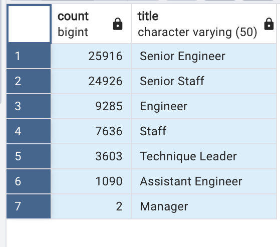

# Pewlett-Hackard-Analysis

### Overview
The purpose of this analysis is to determine the number of retiring employees by title at Pewlett-Hackard (PH), and identify those employees who are eligible to participate in a mentorship program. This data will then be assessed and a written report (herein) provided to management in order to  determine the significance of the employee retirement and an appropriate course of action for handling a large employee retirement wave at the firm. 

The analysis utlizes SQL to extract data from multiple csv files and merge them based on common points, then create new tables. This will assist in consolidating employees that are to retire soon and exclude retired persons as well as pinpoint departments with an upcoming large number of vacancies. Then a list is generated to identify mentors from the retirement list and apply this information to the firms mentorship program and reduce turnover issues.

### Results
The results of the SQL comparison of employee data and  expert analysis of the outputs revealed the following four major points.

1. Number of Retiring Employees

The first part of the data analysis identified the number of current PH employees (by title) eligible for retirement.  

- This data was counted and revealed there are a total of nearly 72,500 employees eligible for retirement due to the age of employee. 

Also, the analysis identified for the retirement eligible emploees, the

- Only 2.0 of them are managers, while 26k are senior engineers, and 25k are senior staff!  In fact, 50% of all retire eligble employees are engineer positions.  

See the retiring tables data.

2. Eligible for Mentorship

The second part of the data analysis identified the number of current PH employees eligible for the mentorship program.  

- There were only 1,549 employees in all who are eligible for the PH mentorship program.  

- This represents a extremely small percentage, two percent (2%) of the total eligible for pending retirement.

### Summary
The large number of PH employees eligible for retirement,  73 thousand across 7 job titles, shows a heavily weighted  pool of positions.  And 50% of these employees are engineering titles.  Only 2 managers are eligble in the entire group, revealing management are comprised of considerably more recent hires and likely less experienced in company protocols. This could present a risk in time and experience for implementing a successful mentorship program, let alone strain the time needed to support quality mentoring.

The limited number of PH employees eliegible for mentorship, is 2% (approx. 1600 out of 73,000) of all retiring employees.  This reveals a significant concern for the ability to bring on new employees and mentor them in the short amount of time due to pending and ongoing retirements.